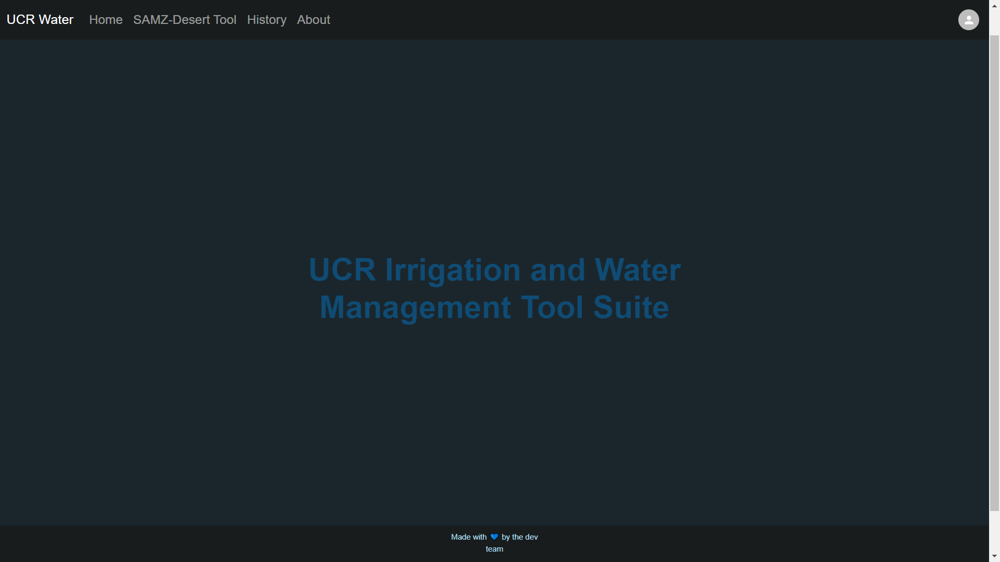
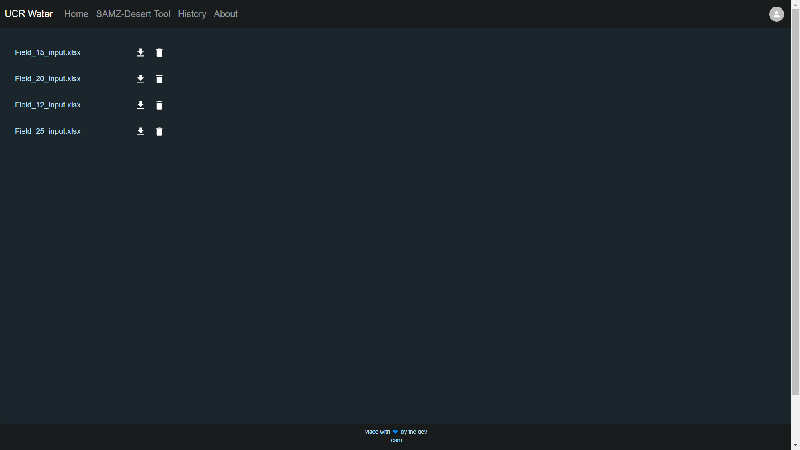
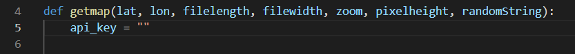
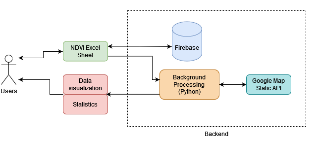

# SAMZ Dessert Tool

> Some files have been removed for privacy reasons  
## Table of Contents
- [Overview](#overview)
- [Using the Site](#using-the-site)
- [Installing and Running](#installing-and-running)
- [Diagrams](#diagrams)
- [Trello](#trello-board)
- [Dependencies](#dependencies)

## Overview
This is the Irrigation Water Management Tool Suite. It's a site that hosts tools that help farmers make better decisions about their farms. These tools were also created to tackle California's water scarcity problems.

The first tool is in collaboration with Dr. Akanksha Garg and Dr. Amir Haghverdi from the [Haghverdi Water Management Group](http://www.ucrwater.com/). With their guidance, we developed an advanced version of the SAMZ-Desert Tool. This is a tool for agricultural management zones that relies on NDVI satellite data. The old implementaion only worked on specific fields in Imperial County. We expanded on the tool and allowed users to upload their own field data. Now the tool can be used by farmers from around the world.

## Team Advisors
<a href="https://github.com/msalloum" target="_blank">Mariam Salloum </a>

<a align="left" href="http://www.ucrwater.com/" target="_blank">Dr. Akanksha Garg</a> 

<a align="left" href="http://www.ucrwater.com/" target="_blank">Dr. Amir Haghverdi</a> 

## Development Team 
<a href="https://github.com/seabass04" target="_blank">Sebastian Garcia</a>

<a href="https://github.com/RobertNavarro" target="_blank">Robert Navarro</a>

<a href="https://github.com/daniel-nis" target="_blank">Daniel Nissan</a>

<a href="https://github.com/jc2673528" target="_blank">Juan Castellon</a>

## Using the Site
When you first visit the site you'll see the home page

You'll notice in the top right corner there's a profile icon. Clicking this icon will allow you to sign in using a Google account. If you choose to sign in, all of your uploaded files will be saved for you to download later. Signing in is completely optional. Clicking SAMZ Desert Tool on the navigation bar will take you to the tool.

This is the Samz Desert Tool page where you upload an Excel file containing NDVI data for your field. 


If your file is in the correct format, the tool will extract the necessary dimensions. You can find out more about the formatting by clicking the "learn more" button. If you have the center coordinates for your field then input them to get a georeferenced image of your field. If you don't have them, leave the latitude and longitude boxes blank. 

If you signed in, navigate to the History Page by clicking the button on the navigation bar. 

Here you will see all the files you have uploaded while signed in. If you click the download button next to the filename you'll immediately download the file.

If you want to know more about the tool and who had a hand in making it then visit the About Page.

## Installing and Running
Start off by installing Python 3.10 and running
```
pip install pandas numpy matplotlib scikit-learn Pillow opencv_python requests
```
You should now have almost all of the necesarry packages. The last package needed is GDAL. There are instructions [here](https://pypi.org/project/GDAL/) on how to install it. Some of us were developing on Windows and had to install the wheel file. We are using the wheel file
```
GDAL‑3.4.1‑cp310‑cp310‑win_amd64.whl
```
and that can be found [here](https://www.lfd.uci.edu/~gohlke/pythonlibs/#gdal). If you are on Windows drag this file to the backend folder. Switch your directory to the backend folder and run
```
pip install GDAL-3.4.1-cp310-cp310-win_amd64.whl
```

After that, install Node.js version 16.13.1. You can find that [here](https://nodejs.org/download/release/v16.13.1/). Please use this version because there are some compatibility problems with the newer versions.

Once you have Python and Node.js installed go ahead and download all of our code from GitHub.

Then, from the root of the project directory you want to run
```
npm install
```
This will install all the necessary packages for the frontend of the project. The backend has it's packages it needs, so navigate to the backend folder. Run the same install command from the backend folder.

Now you should have all the packages you need to get the project running.

You're going to need a Google Maps API key in order to generate satellite images. You can learn about how to get them [here](https://developers.google.com/maps/documentation/javascript/get-api-key).

Once you get your API key, you will enter it into the file
```
geoprocessing.py
```
which can be found in the backend folder.

The API key should be a long string that goes directly into the quotes here
 <br>
Make sure you never upload your API key to GitHub or any other public website.

You should still be in the backend folder. Run the command
```
npm start
```
to get the backend server running. You should see an output in the terminal if it was successful.

Open another terminal, but do not close the terminal of the backend. In this new terminal make sure you are at the root of the project folder. We want to get the frontend server running now.

From the root, run
```
npm run build
```
This will build the app for production to the build folder.

We're almost done! Now run
```
npm start
```
again to get the frontend server started. You should see an output in the terminal if it was successful. Simply click the link that gets outputed to be brought to the website.

## Diagrams

### System Diagram 
  

### Sequence Diagram  
  


## Trello Board
[This](https://trello.com/b/ar2vNBUt/farmersonly) is where we are tracking features and picking what we want to work on.

## Dependencies
[Python 3.10](https://www.python.org/downloads/release/python-3100/)  
[Node.js version 16.13.1](https://nodejs.org/download/release/v16.13.1/) 

